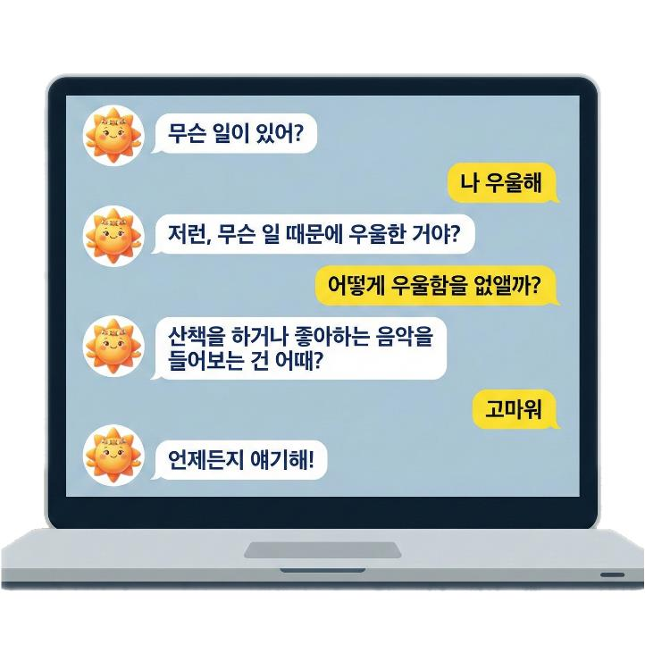
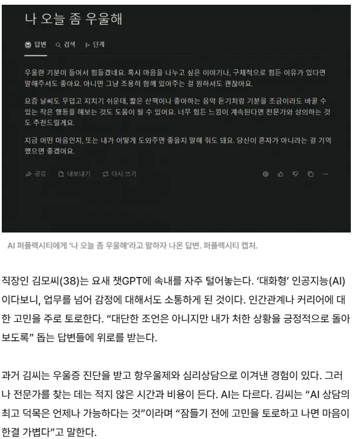
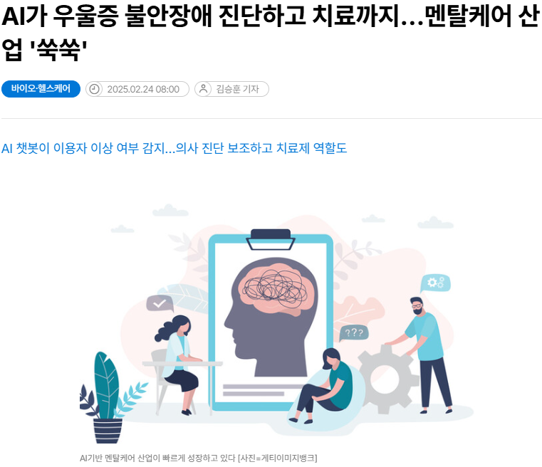
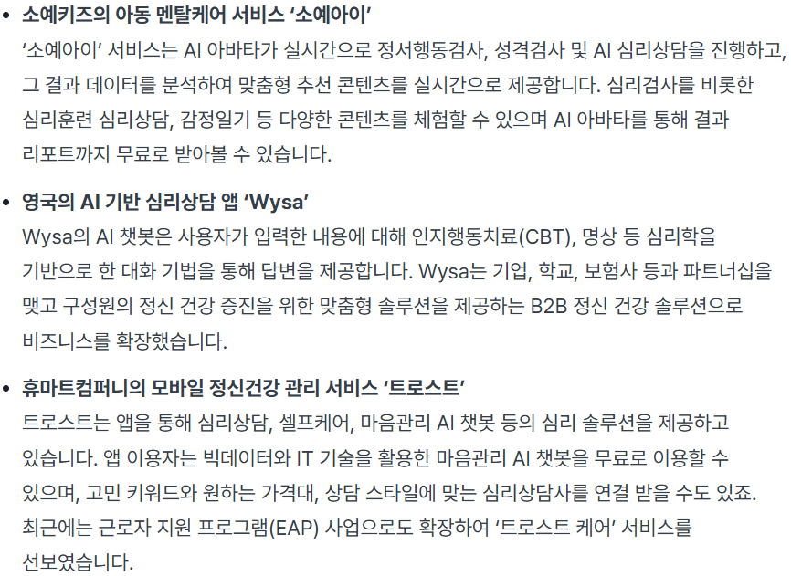
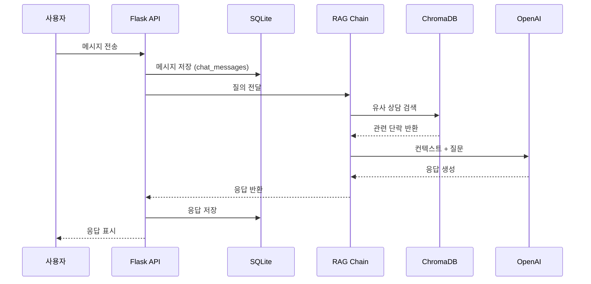
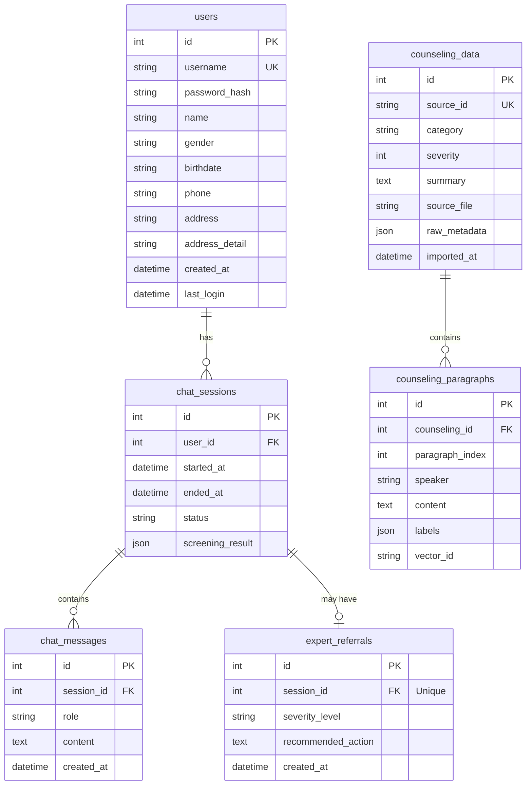
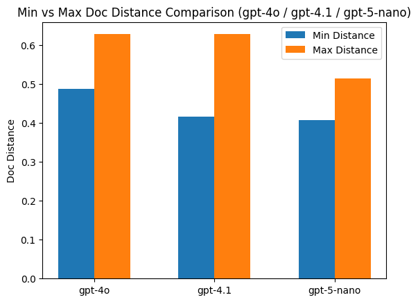
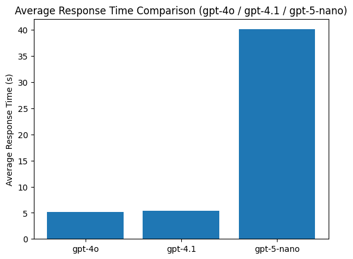
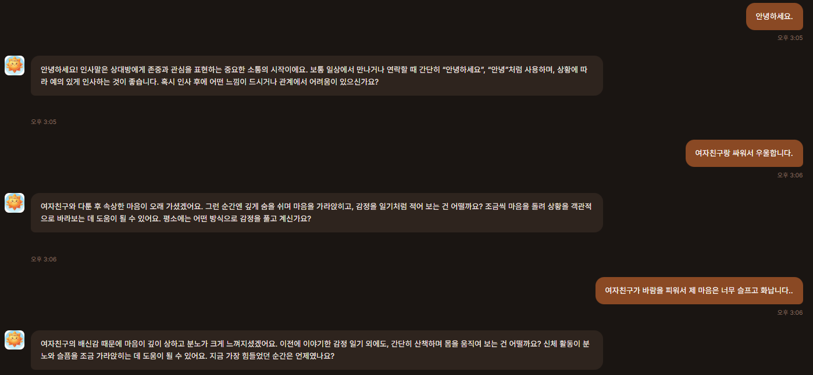

# SKN21-3rd-3Team

<div align="center" style="margin:0; padding:0;">
  
</div>

<div align="center" style="margin-top:-8px;">
  
</div>

<br>

---

<br>

<h1>1️⃣ 팀 구성 및 역할 분담</h1>
<p style="margin-bottom: 10px;">
  <strong>Team 수도</strong></p>
<p style="margin-top: 0; color: #666;">
  <em>📢 수빈님! 도와주세요! </em></p>

<table>
<tr>
<!-- 박수빈 -->
<td align="center" width="16.6%" valign="top" style="padding: 10px;">
    <div style="width: 120px; height: 120px; overflow: hidden;">
      
    </div>
    <h3 style="margin: 10px 0 5px 0;">박수빈</h3>
    <div>
      <p style="margin: 0; font-size: 13px; line-height: 1.4;"> 
        <strong>대장</strong>  | 임베딩 설계 <br/>
        UI 화면 구현
      </p>
    </div>
    <a href="https://github.com/sbpark2930-ui">
      
    </a>
</td>

<!-- 손현우 -->
<td align="center" width="16.6%" valign="top" style="padding: 10px;">
    <div style="width: 120px; height: 120px; overflow: hidden;">
      
    </div>
    <h3 style="margin: 10px 0 5px 0;">손현우</h3>
    <div>
      <p style="margin: 0; font-size: 13px; line-height: 1.4;"> 
      테스트 설계 <br/> 
      RAG 성능평가
      </p>
    </div>
    <a href="https://github.com/kevinhwsohn-afk">
      
    </a>
</td>
    
<!-- 우재현 -->
<td align="center" width="16.6%" valign="top" style="padding: 10px;">
    <div style="width: 120px; height: 120px; overflow: hidden;">
      
    </div>
    <h3 style="margin: 10px 0 5px 0;">우재현</h3>
    <div>
      <p style="margin: 0; font-size: 13px; line-height: 1.4;"> 
      RAG 로직 설계/구현 <br/> 
      History-to-PDF 변환 <br/>
      </p>
    </div>
    <a href="https://github.com/Wjaehyun">
      
    </a>
</td>

<!-- 이성진 -->
<td align="center" width="16.6%" valign="top" style="padding: 10px;">
    <div style="width: 120px; height: 120px; overflow: hidden;">
      
    </div>
    <h3 style="margin: 10px 0 5px 0;">이성진</h3>
    <div>
      <p style="margin: 0; font-size: 13px; line-height: 1.4;"> 
      데이터 수집 <br/>
      prompt 개선
      </p>
    </div>
    <a href="https://github.com/krsjlee">
      
    </a>
</td>

<!-- 장이선 -->
<td align="center" width="16.6%" valign="top" style="padding: 10px;">
    <div style="width: 120px; height: 120px; overflow: hidden;">
      
    </div>
    <h3 style="margin: 10px 0 5px 0;">장이선</h3>
    <div>
      <p style="margin: 0; font-size: 13px; line-height: 1.4;"> 
      데이터 전처리·청킹 <br/>
      README 작성 
      </p>
    </div>
    <a href="https://github.com/jang-yiseon">
      
    </a>
</td>

<!-- 조남웅 -->
<td align="center" width="16.6%" valign="top" style="padding: 10px;">
    <div style="width: 120px; height: 120px; overflow: hidden;">
      
    </div>
    <h3 style="margin: 10px 0 5px 0;">조남웅</h3>
    <div>
      <p style="margin: 0; font-size: 13px; line-height: 1.4;"> 
      Retriever 구현 <br/>
      prompt 개선, 테스트 <br/>
      </p>
    </div>
    <a href="https://github.com/whskadnd">
      
    </a>
</td>
</tr>

</table>

<br>

---

<br>

<h1>2️⃣ 프로젝트 소개</h1>

## 프로젝트 주제

<strong>심리 상담 데이터를 기반으로 한 RAG(검색 증강 생성) 구조의 심리 상담 챗봇 서비스</strong>

## 프로젝트 선정 이유

- AI 정서 관리의 확산: 기술의 발전으로 정서적 지원 영역에서도 대화형 AI를 활용하려는 시도가 빠르게 확산되고 있습니다.

- 자기 돌봄(Self-care)의 필요성: AI 기반 챗봇은 단순 질의응답을 넘어 사용자의 감정 상태를 인식하고 공감적 반응을 제공함으로써 현대인의 일상적 멘탈케어 도구로 주목받고 있습니다.

- 데이터 기반의 신뢰성: 단순한 LLM의 생성을 넘어, 실제 상담 사례를 기반으로 더 안전하고 맥락에 맞는 응답을 제공하고자 합니다.

<table align="center" width="100%">
  <!-- 이미지 행 -->
  <tr>
    <td align="center">
      
    </td>
    <td align="center">
      
    </td>
    <td align="center">
      
    </td>
  </tr>

  <!-- 캡션 행 -->
  <tr>
    <td align="center">
      <div style="margin-top:12px; font-size:13px;">
        <b>① AI 상담 응답 사례</b>
      </div>
    </td>
    <td align="center">
      <div style="margin-top:12px; font-size:13px;">
        <b>② 멘탈케어 산업 확산 기사</b>
      </div>
    </td>
    <td align="center">
      <div style="margin-top:12px; font-size:13px;">
        <b>③ AI 심리상담 서비스 사례</b>
      </div>
    </td>
  </tr>
</table>

<br>

## 주요 기능

- 📖 실제 심리 상담 데이터를 기반으로 한 **RAG 파이프라인 구축**
- 🧩 발화 단위 임베딩을 통한 **맥락 기반 상담 응답 생성**
- 🧠 심리 카테고리(우울·불안·중독·일반)에 따른 **상담 흐름 분기**
- 🚨 대화 중 위험 신호 감지 및 **전문가 연결 경고 문구 출력**
- 📄 대화 요약 및 일상 솔루션을 담은 **PDF 상담 리포트 발급**
- 🖥️ HTML 기반 **상담 챗봇 UI 구현**

<br>

## 시스템 동작 원리 및 서비스 흐름

### 1️⃣ 데이터 파이프라인 (Processing)

1. **상담 데이터 수집**: JSON 형식의 상담 내역 수집 및 전처리
2. **청킹 및 메타데이터**: 효율적 검색을 위한 발화 단위 분할 및 정리
3. **벡터 DB 저장**: ChromaDB에 임베딩 데이터 인덱싱

### 2️⃣ 답변 생성 프로세스 (Inference)

4. **유사 사례 검색**: 사용자 질문과 가장 유사한 과거 상담 사례 검색
5. **LLM 응답 생성**: 검색된 컨텍스트를 활용한 맞춤형 답변 생성
6. **이력 관리**: 대화 기록 및 위험도 분석 결과 SQLite 저장

<br>



<br>

## 🛠 Tech Stack

### 🔧 Backend / RAG


### 🧠 Vector Search & Database


### 🖥️ Frontend


### ⚙️ Dev Environment


<br>

---

<br>

# 3️⃣ 📁프로젝트 디렉토리 및 파일 구조

</div>

```plaintext
SKN21-3rd-3Team/
├── data/
│   └── raw/                       # 원본 심리상담 데이터(json)
|
├── src/
│   ├── data/
│   |    ├── preprocess_data.py    # 상담 데이터 전처리
│   |    ├── embed_to_vectordb.py  # 전처리 데이터 임베딩 및 ChromaDB 저장
│   |    └── vector_loader.py      # VectorDB 로드 및 컬렉션 선택
|   |
│   ├── database/
│   |    ├── vector_store.py       # ChromaDB 래퍼 및 검색 인터페이스
│   |    ├── database_schema.py    # 데이터 구조 정의
│   |    └── db_manager.py         # DB 접근 및 관리 로직
|   |
│   ├── rag/
│   |    ├── rewrite.py            # 대화 히스토리 기반 쿼리 재작성
│   |    ├── retriever.py          # 유사 상담 사례 검색
│   |    ├── answer.py             # 답변 생성 및 후처리
│   |    └── chain.py              # RAG 전체 흐름 제어
|   |
│   └── utils/                     # 공통 유틸리티 함수
│        └── pdf_exporter.py       # 대화 기록 기반 PDF 리포트 생성 및 변환
|
├── app/
│    ├── main.py                    # Flask 엔트리포인트
│    ├── templates/                 # HTML 템플릿
│    └── static/                    # 정적 파일
|
├── config/                        # 설정 파일
├── docs/                          # 산출물, 설계 문서 및 가이드
├── images/                        # README / 발표용 이미지
├── tests/                         # 테스트 코드
│
├── .gitignore
├── requirements.txt
└── README.md

```

<br>

---

<br>

# 4️⃣ 수집 데이터 설명

## 📊 데이터 개요

- **데이터 출처**: [AI Hub 심리상담 데이터셋](https://www.aihub.or.kr/aihubdata/data/view.do?pageIndex=1&currMenu=115&topMenu=100&srchOptnCnd=OPTNCND001&srchDetailCnd=DETAILCND001&srchOrder=ORDER001&srchPagePer=20&srchDataRealmCode=REALM006&aihubDataSe=data&dataSetSn=71806)
- **카테고리**: 우울(DEPRESSION), 불안(ANXIETY), 중독(ADDICTION), 일반(NORMAL)
- **형식**: json(상담 원문 발화 및 라벨, 메타데이터 )
- **구조**: 상담 세션 단위 → 발화(paragraph) 단위 분리

<br>

## 🧠 데이터 전처리 & 임베딩 개요

- json 파일에서 `상담사 / 내담자` 발화를 기준으로 발화 단위 분리
- json 파일에서 연령, 성별, 상담 카테고리, 심리 지표(우울·불안·중독 등) 추출
- 발화 텍스트만 임베딩하여 ChromaDB(Vector DB)에 저장

<br>

## ⚠️ 윤리 및 안전 설계 개요

- 심리상담 챗봇은 **의료·심리 진단 도구가 아님!**
- 자해·자살 등 고위험 키워드 감지 시:
  - 즉각적인 주의 안내 메시지 제공
  - 전문 기관 또는 주변 도움을 권고하는 가이드 문구 출력
- 모든 상담 데이터는 **익명화된 공개 데이터**만 사용

<br>

## Data & Baseline Setup

- **데이터 구조**  
  AI Hub 심리상담 데이터셋을 기반으로, 다수의 상담 대화 기록과 해당 대화에 대한 라벨 및 메타데이터가 JSON 형식으로 구성 됨.

- **카테고리 구성**
  - `DEPRESSION` (우울)
  - `ANXIETY` (불안)
  - `ADDICTION` (중독)
  - `NORMAL` (일반)

<br>

## Data Preprocessing & Chunking 검증

- **전처리 목적**  
  비정형 상담 대화를 RAG 검색 및 응답 생성에 적합한 구조로 변환

- **전처리 파이프라인**

  1. json 파일 파싱 → 발화 단위 분리, 메타데이터 및 상담 요약 추출
  2. 발화 단위 데이터와 메타데이터 통합
  3. DB 저장용 구조로 변환

  ### 🔹 `Chunking Strategy` — 발화 단위 분리

  | 항목      | 설명                          |
  | --------- | ----------------------------- |
  | 분리 기준 | `상담사 :` / `내담자 :`       |
  | 저장 단위 | 발화(sentence-level)          |
  | 포함 정보 | 화자, 발화 내용, 세션 내 순서 |

<br>

## Data Preprocessing Strategy

심리상담 대화 데이터를 RAG 검색 및 응답 생성에 적합한 형태로 변환하기 위해, 파일 매칭·텍스트 정규화·화자 분리를 포함한 전처리 절차를 적용.

### Data Matching & Loading

- File ID matching: 정규식 패턴 [DAXN]\d{3}을 기준으로 TXT(대화 원문)와 JSON(라벨/메타데이터) 파일을 매칭.
- Encoding fallback: 한글 깨짐 방지를 위해 utf-8-sig → utf-8 → cp949 순서로 디코딩.

### Text Normalization

- RAG 검색 품질과 응답 생성을 안정화하기 위해, 데이터 내 특수 태그를 자연어 또는 일반화 토큰으로 정규화.
  > @COUNSELOR → 상담사
  > @NAME → 내담자
  > @PLACE, @AGE 등 → [PLACE], [AGE] 형태로 일반화 토큰을 유지

### Speaker Segmentation

- 정규식(상담사|내담자) 기반으로 화자를 명확히 분리.
- 여러 줄로 이어지는 발화는 하나의 턴(Turn)으로 병합하여 대화 흐름이 끊기지 않도록 처리.

<br>

## Chunking Strategy (Window Sliding)

### Overview

- 대화 맥락을 유지하면서 검색 단위를 과도하게 키우지 않기 위해, **현재 발화(Current Turn)**를 중심으로 이전(Pre-context) 및 다음(Post-context) 발화를 포함하는 방식으로 청크를 생성.
  - Method: Window Sliding
  - Center: Current Turn
  - Context: Pre-context + Post-context (총 3턴 구성)
- 예시:
  - (Context-1) 상담사: 요즘 기분이 좀 어떠세요?
  - (Current) 내담자: 계속 우울하고 잠도 잘 안 와요. (검색 중심)
  - (Context+1) 상담사: 불면증 때문에 많이 힘드시겠네요.

### Rationale

- Context awareness: 상담 데이터는 단일 발화만으로 의미가 부족한 경우가 많아, 앞뒤 문맥 포함이 필요.
- Retrieval quality: 상담사의 질문과 내담자의 응답이 함께 포함된 청크는 상황 정보가 풍부하여 유사 사례 검색에 유리.
- Token efficiency: 전체 세션 단위 임베딩 대비, 3턴 윈도우는 정보 밀도를 유지하면서도 컨텍스트 길이(토큰) 측면에서 효율적임.

<br>

## Data Storage Strategy

- 전처리 및 청킹 결과는 목적에 따라 관계형 저장소와 벡터 저장소로 분리하여 관리.
- ChromaDB (vector_store): 청킹된 텍스트를 임베딩하여 벡터로 저장하며, category, speaker, session_id 등 메타데이터를 함께 저장해 필터 기반 검색을 지원.

<br>

---

<br>

## 5️⃣ 데이터 베이스 테이블 설명

### 데이터베이스 설계 개요 (ERD; Entity Relationship Diagram)



<br>

## 테이블 설명

### 1. `users` (사용자)

| 컬럼           | 타입         | 설명                  |
| -------------- | ------------ | --------------------- |
| id             | INTEGER      | Primary Key           |
| username       | VARCHAR(50)  | 아이디 (Unique)       |
| password_hash  | VARCHAR(255) | Bcrypt 해시 비밀번호  |
| name           | VARCHAR(50)  | 이름                  |
| gender         | VARCHAR(10)  | 성별 (male/female)    |
| birthdate      | VARCHAR(10)  | 생년월일 (YYYY-MM-DD) |
| phone          | VARCHAR(20)  | 전화번호              |
| address        | VARCHAR(255) | 기본 주소             |
| address_detail | VARCHAR(255) | 상세 주소             |
| created_at     | DATETIME     | 생성일시              |
| last_login     | DATETIME     | 마지막 로그인         |

<br>

### 2. `chat_sessions` (채팅 세션)

| 컬럼             | 타입        | 설명                               |
| ---------------- | ----------- | ---------------------------------- |
| id               | INTEGER     | Primary Key                        |
| user_id          | INTEGER     | 사용자 FK                          |
| started_at       | DATETIME    | 세션 시작 시간                     |
| ended_at         | DATETIME    | 세션 종료 시간                     |
| status           | VARCHAR(20) | 상태 (active, completed, referred) |
| screening_result | JSON        | 증상 선별 결과                     |

<br>

### 3. `chat_messages` (채팅 메시지)

| 컬럼       | 타입        | 설명                             |
| ---------- | ----------- | -------------------------------- |
| id         | INTEGER     | Primary Key                      |
| session_id | INTEGER     | 세션 FK                          |
| role       | VARCHAR(10) | 발화자 (user, assistant, system) |
| content    | TEXT        | 메시지 내용                      |
| created_at | DATETIME    | 생성일시                         |

<br>

### 4. `expert_referrals` (전문가 연결)

| 컬럼               | 타입        | 설명                                    |
| ------------------ | ----------- | --------------------------------------- |
| id                 | INTEGER     | Primary Key                             |
| session_id         | INTEGER     | 세션 FK (Unique)                        |
| severity_level     | VARCHAR(20) | 심각도 (mild, moderate, severe, crisis) |
| recommended_action | TEXT        | 권장 조치                               |
| created_at         | DATETIME    | 생성일시                                |

<br>

### 5. `counseling_data` (상담 원본 데이터)

| 컬럼         | 타입        | 설명                                           |
| ------------ | ----------- | ---------------------------------------------- |
| id           | INTEGER     | Primary Key                                    |
| source_id    | VARCHAR(20) | 원본 ID (D012, X007 등) - Unique               |
| category     | VARCHAR(20) | 카테고리 (DEPRESSION/ANXIETY/ADDICTION/NORMAL) |
| severity     | INTEGER     | 심각도 (0-3)                                   |
| summary      | TEXT        | 상담 요약                                      |
| source_file  | VARCHAR     | 원본 파일 경로                                 |
| raw_metadata | JSON        | 원본 메타데이터 (나이, 성별 등)                |
| imported_at  | DATETIME    | 임포트 시간                                    |

<br>

### 6. `counseling_paragraphs` (상담 발화 데이터)

| 컬럼            | 타입        | 설명                      |
| --------------- | ----------- | ------------------------- |
| id              | INTEGER     | Primary Key               |
| counseling_id   | INTEGER     | counseling_data FK        |
| paragraph_index | INTEGER     | 발화 순서                 |
| speaker         | VARCHAR(10) | 화자 (상담사/내담자)      |
| content         | TEXT        | 발화 내용                 |
| labels          | JSON        | 심리학적 라벨 (40개 항목) |
| vector_id       | VARCHAR     | ChromaDB 문서 ID          |

<br>

## 관계도 요약

```
users (1) ──── (N) chat_sessions (1) ──── (N) chat_messages
                        │
                        └──── (0..1) expert_referrals

counseling_data (1) ──── (N) counseling_paragraphs ──── ChromaDB (Vector)
```

- **users ↔ chat_sessions**: 1:N (한 사용자가 여러 채팅 세션 보유)
- **chat_sessions ↔ chat_messages**: 1:N (한 세션에 여러 메시지)
- **chat_sessions ↔ expert_referrals**: 1:0..1 (세션당 최대 1개의 전문가 연결)
- **counseling_data ↔ counseling_paragraphs**: 1:N (한 상담 세션에 여러 발화)
- **counseling_paragraphs ↔ ChromaDB**: 발화 내용이 임베딩되어 벡터로 저장

<br>

## Database (ChromaDB)

- RAG을 위해 **ChromaDB(Vector Database)** 를 데이터베이스로 사용함.
- ChromaDB는 텍스트 데이터를 임베딩 벡터로 저장하고, 벡터 간 유사도를 기반으로 관련 상담 발화를 검색하는 역할을 수행.
- 관계형 데이터베이스의 테이블 대신, ChromaDB의 **Collection 구조를 논리적인 데이터 테이블 단위로 정리**함.

<br>

## ChromaDB Collection 구조

| 구성 요소           | 설명                                                       |
| ------------------- | ---------------------------------------------------------- |
| id                  | 문서(발화) 단위의 고유 식별자                              |
| document            | 상담 발화 원문                                             |
| embedding           | 발화 텍스트의 임베딩 벡터                                  |
| metadata.session_id | 상담 세션 식별자                                           |
| metadata.category   | 심리 상태 분류 (DEPRESSION / ANXIETY / ADDICTION / NORMAL) |
| metadata.speaker    | 발화 주체 (user / assistant)                               |
| metadata.turn_index | 세션 내 발화 순서                                          |

<br>

## 데이터베이스 활용 방식

- 상담 발화 텍스트를 전처리한 후 임베딩하여 ChromaDB에 저장함.
- 저장된 벡터는 유사도 검색을 통해 RAG Retriever 단계에서 활용됨.
- metadata 정보는 검색 결과 필터링 및 상담 맥락 유지를 위해 사용됨.

<br>

---

<br>

# 6️⃣ Application의 주요 기능

## 🖥️ UI & 핵심 기능 소개

<table align="center" width="100%">
  <tr>
    <td align="center"><b>심리 상태 자가 진단</b></td>
    <td align="center"><b>실시간 AI 심리 상담</b></td>
  </tr>
  <tr>
    <td align="center">
      
    </td>
    <td align="center">
      
    </td>
  </tr>
  <tr>
    <td align="center"><b>문진을 통한 상태 확인</b></td>
    <td align="center"><b>공감 기반 대화 인터페이스</b></td>
  </tr>
</table>

- 유저 관리: 회원가입/로그인 및 마이페이지를 통한 개인별 맞춤 정보 관리
- 자가 진단 서비스: 상담 전 문진 기능을 통해 사용자의 현재 심리 상태를 간단히 스크리닝
- 멀티 세션 대화 히스토리: LLM 기반의 새 대화 생성 및 과거 상담 이력 보존 기능
- 실시간 상담: RAG 엔진을 활용한 맥락 인지형 심리 상담 대화
- 상담 리포트 발급: 상담 종료 후 대화 내용을 분석하여 PDF 결과 리포트 제공

## ⚙️ 챗봇 동작 프로세스 (Pipeline)

사용자의 발화가 입력되면 다음과 같은 단계를 거쳐 최적의 응답을 생성.

- Input: 사용자 메시지 수신 및 발화 의도 파악
- Memory: SQLite DB를 활용한 대화 기록 및 세션 정보 로드
- Retrieval: ChromaDB에서 유사 상담 사례 검색 (Similarity Search 적용)
- Augmentation: 검색된 상담 맥락 + System Prompt(공감/위로 가이드) 결합
- Generation: GPT-4o 모델을 통한 개인화된 상담 응답 생성
- Safety Check: 정서 위험 신호 감지 시 안전 스크리닝 안내 로직 자동 활성화

<br>

## 🧠 Retriever & RAG 실험전략

### 🔍 Retriever 선정 및 기술 검증

사용자의 질문에 가장 적합한 상담 사례를 찾기 위해 Similarity 방식과 MMR(Maximum Marginal Relevance) 방식의 성능을 비교 분석.

### 1. 검색 알고리즘 정의 및 특징

| 구분       | 방식                                 | 검색 특징                 | 상담 적용 관점                                        |
| ---------- | ------------------------------------ | ------------------------- | ----------------------------------------------------- |
| Similarity | 벡터 거리 기반 최상위 유사 문서 추출 | 유사도 중심 검색          | 한 내담자의 특정 상담 맥락을 깊이 있게 참조           |
| MMR        | 유사도와 다양성의 균형 최적화        | 유사도 + 다양성 복합 검색 | 여러 상담 사례에서 유사한 슬픔의 양상을 다양하게 참조 |

### 2. 데이터 구조 기반 분석 지표

- 실험 결과의 객관성을 확보하기 위해 다음 두 가지 지표를 기준으로 검색 결과의 다양성을 측정.

- source_id: 서로 다른 상담 사례 단위
- session_id: 동일 사례 내의 회차별 상담 대화 단위

---

### 3. 알고리즘 비교 실험 결과

<p align="center">  </p>

**Similarity vs MMR 실험 요약**

- 지표 유사성: 동일 쿼리 및 top-k 조건에서 Similarity와 **MMR(real)**은 session_id 및 source_id 기준의 다양성 지표에서 유의미한 차이를 보이지 않음.

- 가중치 영향도: lambda_mult=0.5 설정 시 MMR이 구조적으로 유사도 중심인 Similarity와 거의 동일한 결과를 반환함을 확인.

- 과도한 다양성 실험: lambda_mult=0.1 설정(다양성 90%) 시 결과 분산은 증가했으나, 상담 심리 문맥에서 요구되는 핵심 주제와의 일관성이 결여되어 실제 서비스 적용에는 부적합한 것으로 판단.

### 4. 최종 Retriever 선정: Similarity Retriever

실험 결과를 바탕으로 다음 세 가지 이유를 근거로 Similarity 방식을 최종 채택.

- 문맥의 일관성: 상담 심리 서비스 특성상, 산만한 사례 나열보다는 특정 상담 맥락의 깊이 있는 이해가 고품질 응답 생성에 유리.

- 해석 용이성: 검색 결과가 사용자 질문의 의도(Relevance)에 충실하여 AI 응답의 인과 관계가 명확.

- 효율성: 복잡한 다양성 계산 과정 없이 실시간 상담 환경에서 안정적이고 빠른 검색 성능을 보장.

<br>

## 모델 선정 배경

실시간 상담 서비스의 핵심인 **지연시간**과 **응답정확도**를 기준으로 모델을 비교하였으며 총 6개의 모델을 사용해서 진행하였다.
특히 상담 서비스의 특성상 응답 지연은 내담자의 감정 몰입을 깨뜨리고 불안·분노를 유발할 수 있기 때문에, 지연시간을 응답 정확도보다 우선적인 평가 요소로 두고 모델을 선정.

<table align="center" width="100%">
  <tr>
    <td align="center">
      
    </td>
    <td align="center">
      
    </td>
  </tr>
  <tr>
    <td align="center"><b>Doc Distance Comparison</b></td>
    <td align="center"><b>Response Time Comparison</b></td>
  </tr>
</table>

- Distance Comparison review

  > 유클리드 거리 기법으로 retriever 점수를 적용. 0에 가까울 수록 더 높은 점수를 얻는 모델을 확인하려 시도함.
  > GPT5 모델류가 가장 뛰어난 성능을 보이고 있으나, 큰 차이를 보이고 있지 않다고 판단함.

- Time Comparison review
  > GPT5 모델류의 응답 지연이 심각했기 때문에, GPT4 모델류 쪽에서 모델을 선정하기로 결정함.

<table align="center" width="100%">
  <tr>
    <td align="center">
      
    </td>
    <td align="center">
      
    </td>
    <td align="center">
      
    </td>
  </tr>
  <tr>
    <td align="center"><b>GPT-4o</b></td>
    <td align="center"><b>GPT-4.1</b></td>
    <td align="center"><b>GPT-5-nano</b></td>
  </tr>
</table>

- 최종적으로 상담을 진행해 본 결과 지연시간이 우수하며, 상담 맥락 이해와 응답 품질 측면에서 안정적인 성능을 수행하는 GPT-4o모델[OpenAI GPT-4o](https://platform.openai.com/docs/models/gpt-4o)을 사용하기로 결정.

<br>

---

<br>

## 📌 향후 확장 방향 (요약)

- 상담 세션 시계열 기반 위험도 변화 추적
- 감정·정서 변화 추이 시각화
- 멀티모달 입력(음성 → 텍스트) 확장
- 전문가 피드백 기반 응답 평가 루프
- 심리 척도 기반 상태 추정 고도화
- 전문가 상담 연계(Referral / Escalation) 모듈
- 상담 기록 기반 맞춤형 행동·케어 플랜 추천

<br>

## 📄 참고 문서

- `architecture.md` – 시스템 아키텍처
- `DATABASE_DESIGN.md` – DB/ERD 설계
- `DATA_ANALYSIS.md` – 데이터 분석 요약
- `data_collection.md` – 데이터 수집·임베딩 가이드
- `GUIDE_전처리.md` – 전처리 상세 가이드
- `GUIDE_CRUD.md` – ChromaDB CRUD
- `GUIDE_함수.md` – Vector DB 함수 정리
- `SAFETY_SCREENING.md` – 안전 스크리닝 설계

<br>

---

<br>

# 7️⃣ 회고

## ⚠️ 구현 도중 문제와 해결

### Prompt Test (프롬프트 테스트 및 최적화)

- 목표: 심리상담 데이터 자체가 사람과 사람의 대화이다보니, 챗봇 또한 그러한 말투와 반응을 할 수 있게 하는 것, 동시에 상담이 진행되는 것이 목표였다.

  - 인사말 : 상담 시 사람이 인사를 하고 시작하는 것과 같이 인사를 자연스럽게 하고 상담을 시작하게 하려 했다.
  - 상담 진행 : 상담 중 사용자가 다른 내용을 말해도 자연스럽게 상담으로 이끌어갈 수 있도록 하려 했다. 이 과정 가운데 할루시네이션 현상을 최대한 막는 것이 목표였다.

- 문제: 단순한 인사말을 설명하려 하고, 상담을 진행할 때 계속되는 할루시네이션 현상이 일어났다. 내부 데이터 외의 내용에서 대화를 진행하려 했다.

- 해결 : 인사말에 규제를 강화하였고, retriver의 일정 score 제한을 두어 할루시네이션 현상을 최소화 시킴으로 내부 데이터에서만 유사어를 찾도록 억제하였다.

- 미해결점 : 일정부분 해결을 하였으나, 데이터가 특정상담에 집중되어 있기에 우리가 흔한 상담으로 생각할 수 있는 일부 내용에 대처하지 못하는 현상이 일어나기도 했다.

<br>

## 📝 팀원 소감 (Team Retrospective)

| 🧑‍💼 이름    | 🛠 역할                   | 💬 소감                                                                                                                                                                                                                                                                                                                                                                                                                                                                                                                                                                                                           |
| ---------- | ------------------------ | ----------------------------------------------------------------------------------------------------------------------------------------------------------------------------------------------------------------------------------------------------------------------------------------------------------------------------------------------------------------------------------------------------------------------------------------------------------------------------------------------------------------------------------------------------------------------------------------------------------------- |
| **박수빈** | 대장·임베딩 설계·UI      | 데이터처리와 설계쪽에서 시간을 좀 많이 할애하고,다른 영역에서 생각보다 시간이 걸리지 않아, 금방 끝날 줄 알았으나, 모델의 성능개선이 생각보다 쉽지 않았고, 임베딩 작업도, 2번정도 실패하여, 약 6시간을 날리게 되어 시간낭비를 하게 된게 아쉽습니다. 그리고 생각보다 데이터의 처리에 대해서 좀 더 깊게 고민하지 않은거 같아 아쉽습니다.(데이터 노이즈 처리....) 차후 4차 프로젝트가 현 프로젝트를 이어 완성하는 거라면, 데이터 처리와 완성하지 못한 기능을 구현하고 싶습니다. 마지막으로, 다들 열심히 해주셨으나, 제 설계가 미흡해 더 완성도를 올려서 발표하지 못한거 같아 팀원 분들께 심심한 사과의 말씀 드립니다. |
| **손현우** | 테스트 설계·RAG 성능평가 | 이번 프로젝트에서는 Prompt에 있어 테스팅과 Prompt를 직접 제작하며 챗봇의 흐름을 수정하는 역할을 맡았습니다. 심리 상담에 관련되어있어 상당히 민감한 챗봇인 만큼, 대화 흐름을 더 정교하면서도 공감 할수있게 수정하는 것이 결코 쉬운일이 아니라는 것을 진짜 큰 깨달음을 얻은 시간이였습니다.                                                                                                                                                                                                                                                                                                                         |
| **우재현** | RAG 로직 설계·PDF 변환   | 아직까지도 LLM 챗봇 기능이 국내 기업들에 온전히 도입되지 못하는 이유를 느낀 것 같았다. 아직은 이를 개선해야할 사람의 역할이 중요함을 느꼈다. 현재 LLM이 대체불가의 위상을 가지고 있지만, 여전히 부족하다는 것을 깨달았다.                                                                                                                                                                                                                                                                                                                                                                                         |
| **이성진** | Data·Prompt              | 챗봇. 누구나 만든다고. 그것도 아주 쉽게. 딸깍딸깍 몇 번으로. 이거 다 개소리다. 만들기야 쉽겠지. 지피티나 제미나이도 뚝닥. 하지만 '제대로' 만들었는지? 챗봇이 답변 잘하는지? 챗봇 답변 때문에 깊고 깊으며 깊은 빡침을 수도 없이 느꼈다.                                                                                                                                                                                                                                                                                                                                                                            |
| **장이선** | 전처리·청킹·README       | 전처리랑 청킹을 맡았는데, 2차 프로젝트의 경험 덕에 어렵지 않게 했던 것 같습니다. 아무래도 이번 프로젝트에서 제일 어려웠던 것은 모델의 성능 개선이었던 것 같은데… 제가 할 수 있던 게 없어서 README 작성을 맡게 되었고, 평소 책을 잘 안 읽었더니 가독성이 너무 구린 결과물을 도출해낸 것 같아서 많이 아쉽습니다... 그리고 이것 또한 쉽지 않았고, 프로젝트에서 쉬운 것은 하나도 없다는 교훈을 얻었습니다. (쉽게 갈 생각을 한 건 아닙니다!!!🙅‍♀️🙅‍♀️)                                                                                                                                                                     |
| **조남웅** | Retriever·Prompt·테스트  | 이번 프로젝트는 역할은 크게 어려움 없이 잘 갔던 거 같습니다. 팀을 이끌어주신 수빈님과 재현님께 감사드립니다. 또한 프롬프트 문장과 모델에 따라 AI가 학습하는 방향이 달라져서 흥미롭고 재미있는 프로젝트가 되었습니다.                                                                                                                                                                                                                                                                                                                                                                                              |
