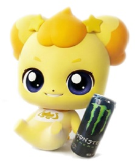
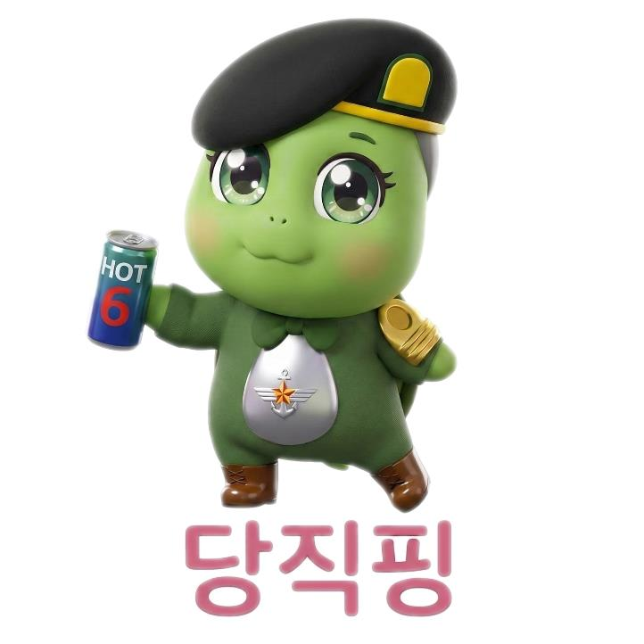

# SKN21-3rd-3Team


<p align="center">
  
  <span style="font-size:32px; font-weight:600; margin-left:10px;">
    🧠 따듯한 AI 심리상담 챗봇, (상담해☀️)
  </span>
</p>

<br>

## 📌 프로젝트 개요

최근 AI 기술의 발전과 함께, 정서적 지원과 심리 상담 영역에서도 대화형 인공지능을 활용하려는 시도가 빠르게 확산되고 있습니다.

   <p align="center">
        
      </p>

본 프로젝트는 **심리 상담 대화 데이터**를 기반으로 한 **RAG(Retrieval-Augmented Generation) 기반 심리상담 챗봇**을 구현하는 것을 목표로 합니다.

AI 챗봇은 단순한 질의응답을 넘어,사용자의 감정 상태를 인식하고 정서적 위로를 제공하는 방향으로 확장되고 있습니다.

  <p align="center">
        
      </p>

기존 규칙 기반 혹은 단순 프롬프트 중심 챗봇의 한계를 넘어, 실제 상담 사례(텍스트 + 라벨)를 구조화·임베딩하여 **유사 상담 맥락을 검색**하고, 이를 바탕으로 **보다 안전하고 맥락적인 상담 응답**을 생성합니다.

본 시스템은 진단이나 치료를 대체하지 않으며, 사용자의 발화 흐름을 바탕으로 우울감·불안 등 정서 상태를 간단한 심리 척도 형태로 추정합니다.

이미 국내외에서는 AI 기반 심리상담 서비스가 정서 관리 및 자기 돌봄(Self-care) 도구로 활용되고 있습니다.

  <p align="center">
        
      </p>

본 프로젝트는 이러한 흐름 속에서, 공감과 위로의 메시지와 함께 일상에서 실천 가능한 간단한 정서 완화 방법 (예: 심호흡, 잠시 산책하기, 휴식 권유 등)을 제안하는 **초기 정서적 지원 및 자기 이해 보조 도구**로서의 역할을 지향합니다.

이를 통해 사용자가 자신의 감정 상태를 인식하고 부담 없이 감정을 정리할 수 있도록 돕는 것을 목표로 합니다.
</br>


<br><br><br>

<h2>👥 팀 구성 및 역할 분담</h2>

<p style="margin-bottom: 4px;">
  <strong>Team 수도</strong></p>
<p style="margin-top: 0; color: #666;">
  <em>📢 수빈님! 도와주세요! </em></p>

<table>
<tr>
<!-- 박수빈 -->
<td align="center" width="200" style="vertical-align: top; padding: 15px;">
    
    <h3 style="margin: 10px 0 5px 0;">박수빈</h3>
    <p style="margin: 5px 0;"> 대장 | ?? </p>
    <a href="https://github.com/sbpark2930-ui">
        
    </a>
</td>

<!-- 손현우 -->
<td align="center" width="200" style="vertical-align: top; padding: 15px;">
    
    <h3 style="margin: 10px 0 5px 0;">손현우</h3>
    <p style="margin: 5px 0;"> ?? </p>
    <a href="https://github.com/sjy361872">
        
    </a>
</td>
    
<!-- 우재현 -->
<td align="center" width="200" style="vertical-align: top; padding: 15px;">
    
    <h3 style="margin: 10px 0 5px 0;">우재현</h3>
    <p style="margin: 5px 0;"> ?? </p>
    <a href="https://github.com/ykgstar37-lab">
       
    </a>
</td>
    
<!-- 이성진 -->
<td align="center" width="200" style="vertical-align: top; padding: 15px;">
    
    <h3 style="margin: 10px 0 5px 0;">이성진</h3>
    <p style="margin: 5px 0;"> ?? </p>
    <a href="https://github.com/ykgstar37-lab">
        
    </a>
</td>

<!-- 장이선 -->
<td align="center" width="200" style="vertical-align: top; padding: 15px;">
    
    <h3 style="margin: 10px 0 5px 0;">장이선</h3>
    <p style="margin: 5px 0;"> ?? </p>
    <a href="https://github.com/wjdtpdus25">
        
    </a>
</td>
    
<!-- 조남웅 -->
<td align="center" width="200" style="vertical-align: top; padding: 15px;">
    
    <h3 style="margin: 10px 0 5px 0;">조남웅</h3>
    <p style="margin: 5px 0;"> ?? </p>
    <a href="https://github.com/silentkit12">
        
    </a>
</td>

</tr>
</table>

<br><br>

## 🎯 프로젝트 목표

* 📖 실제 심리 상담 데이터를 기반으로 한 **RAG 파이프라인 구축**
* 🧩 발화 단위 임베딩을 통한 **맥락 기반 상담 응답 생성**
* 🚨 대화 중 위험 신호 감지 및 **전문가 연결 로직 설계**
* 🧠 심리 카테고리(우울·불안·중독·일반)에 따른 **상담 흐름 분기**
* 🖥️ Streamlit 기반 **상담 챗봇 UI 구현**

---

## 🧩 시스템 아키텍처

<p align="center">
  
</p>

### 전체 흐름 요약

1. 상담 데이터(txt/json) 수집 및 전처리
2. 발화 단위 청킹 및 메타데이터 정리
3. 발화 내용 임베딩 후 ChromaDB 저장
4. 사용자 질문 → 유사 상담 사례 검색
5. 검색 컨텍스트 + 사용자 질문 → LLM 응답 생성
6. 대화 기록 및 위험도 DB 저장

---

## 🛠 Tech Stack

### 🔧 Backend / RAG


### 🧠 Vector Search


### 💾 Database


### 🖥️ Frontend


### ⚙️ Dev Environment


## 📁 프로젝트 폴더 구조
</div>

```plaintext
SKN21-3rd-3Team/
├── data/                       
│   └── raw/                    # 원본 심리상담 데이터(txt / json)
|
├── src/                        # RAG · 데이터 처리 로직
│   ├── data/                   # 데이터 전처리 및 DB 적재 파이프라인
│   ├── database/               # SQLite · ChromaDB 스키마 및 DB 관리
│   └── rag/                    # RAG 응답 생성 로직 (Retriever · Chain)
|
├── app/                        # Flask 기반 웹 애플리케이션
│   ├── main.py                 # Flask 엔트리포인트
│   ├── templates/              # HTML 템플릿
│   └── static/                 # 정적 파일
|
├── config/                     # 설정 파일
├── docs/                       # 설계 문서 및 가이드
├── images/                     # README / 발표용 이미지
├── tests/                      # 테스트 코드
│
├── .gitignore
├── requirements.txt
└── README.md

```
## 🔍 System & Data Overview

본 섹션은 아래에 이어지는 상세 실험·설계 설명(## 1)~)에 앞서,  
본 프로젝트의 **데이터 구성, 처리 흐름, 챗봇 동작 방식, 안전 설계, 확장 방향**을 한눈에 요약합니다.

---

## 📊 데이터 개요

* **데이터 출처**: AI Hub 심리상담 데이터셋
* **카테고리**: 우울(DEPRESSION), 불안(ANXIETY), 중독(ADDICTION), 일반(NORMAL)
* **형식**: txt(상담 원문 발화) + json(라벨 및 메타데이터)
* **구조**: 상담 세션 단위 → 발화(paragraph) 단위 분리

> 상세 데이터 구조 및 컬럼 정의는 **## 1) Data & Baseline Setup** 섹션에서 설명합니다.

---

## 🧠 데이터 전처리 & 임베딩 개요

* txt 파일에서 `상담사 / 내담자` 발화를 기준으로 발화 단위 분리
* json 파일에서 연령, 성별, 상담 카테고리, 심리 지표(우울·불안·중독 등) 추출
* 발화 단위 데이터는 SQLite에 구조화하여 저장
* 발화 텍스트만 임베딩하여 ChromaDB(Vector DB)에 저장

> 핵심 원칙: **구조화 데이터(SQLite)** 와  
> **의미 기반 검색 데이터(ChromaDB)** 를 분리하여 관리

---

## 💬 챗봇 동작 방식 요약

1. 사용자 메시지 입력
2. 대화 기록 및 세션 정보 DB 저장
3. Vector DB에서 유사 상담 발화 검색
4. 검색 결과를 컨텍스트로 LLM 호출
5. 공감·위로 중심의 응답 생성 및 반환
6. 정서 위험 신호 감지 시 안전 안내 로직 활성화

> Retriever, RAG Chain, 응답 생성 로직에 대한 상세 설명은  
> **## 4) Retriever & RAG Baseline** 섹션을 참고합니다.

---

## ⚠️ 윤리 및 안전 설계 개요

* 본 시스템은 **의료·심리 진단 도구가 아님**
* 자해·자살 등 고위험 키워드 감지 시:
  - 즉각적인 주의 안내 메시지 제공
  - 전문 기관 또는 주변 도움을 권고하는 가이드 문구 출력
* 모든 상담 데이터는 **익명화된 공개 데이터**만 사용

> 안전 설계 및 스크리닝 로직은  
> **## 6) Safety & Screening Baseline** 섹션에서 상세히 다룹니다.

---

## 📌 향후 확장 방향 (요약)

* 상담 세션 시계열 기반 위험도 변화 추적
* 감정·정서 변화 추이 시각화
* 멀티모달 입력(음성 → 텍스트) 확장
* 전문가 피드백 기반 응답 평가 루프
* 심리 척도 기반 상태 추정 고도화
* 전문가 상담 연계(Referral / Escalation) 모듈
* 상담 기록 기반 맞춤형 행동·케어 플랜 추천

> 확장 아이디어에 대한 배경 및 근거는  
> **Future Work** 관련 문단에서 추가 설명될 수 있습니다.

---

## 📄 참고 문서

* `architecture.md` – 시스템 아키텍처
* `DATABASE_DESIGN.md` – DB/ERD 설계
* `DATA_ANALYSIS.md` – 데이터 분석 요약
* `data_collection.md` – 데이터 수집·임베딩 가이드
* `GUIDE_전처리.md` – 전처리 상세 가이드
* `GUIDE_CRUD.md` – SQLite & ChromaDB CRUD
* `GUIDE_함수.md` – Vector DB 함수 정리

## 1️⃣ Data & Baseline Setup

- **데이터 구조**  
  본 프로젝트는 AI Hub 심리상담 데이터셋을 기반으로 하며, 상담 원문(`.txt`)과 라벨·메타데이터(`.json`)가 1:1로 매칭된 형태로 구성됩니다.  
  데이터는 `data/raw/` 디렉토리에 **원본 그대로** 저장되며, 전처리 이후의 데이터는 별도로 저장하지 않습니다.

### 🔹 `Original Dataset` — 원천 데이터 구조

| 구분 | 파일 형식 | 설명 |
|---|---|---|
| 상담 대화 | `.txt` | `상담사 :`, `내담자 :` 형식의 실제 상담 대화 원문 |
| 메타데이터 | `.json` | 연령, 성별, 상담 카테고리, 요약, 심리 지표(우울/불안/중독 등) |

<br>

- **카테고리 구성**
  - `DEPRESSION` (우울)
  - `ANXIETY` (불안)
  - `ADDICTION` (중독)
  - `NORMAL` (일반)

<br><br>

## 2️⃣ Data Preprocessing & Chunking 검증

- **전처리 목적**  
  비정형 상담 대화를 RAG 검색 및 응답 생성에 적합한 구조로 변환

- **전처리 파이프라인**
  1. txt 파일 파싱 → 발화 단위 분리  
  2. json 파일 파싱 → 메타데이터 및 상담 요약 추출  
  3. 발화 단위 데이터와 메타데이터 통합  
  4. DB 저장용 구조로 변환

### 🔹 `Chunking Strategy` — 발화 단위 분리

| 항목 | 설명 |
|---|---|
| 분리 기준 | `상담사 :` / `내담자 :` |
| 저장 단위 | 발화(sentence-level) |
| 포함 정보 | 화자, 발화 내용, 세션 내 순서 |

<br>

- 동일 세션 내 발화는 순서를 유지하며 저장되어,  
  검색 결과가 실제 상담 흐름을 최대한 반영하도록 설계되었습니다.

<br><br>

## 3️⃣ Database & Vector Store Baseline

- **이중 DB 구조**
  - **SQLite**: 상담 세션, 발화 메타데이터, 사용자 정보 등 구조화 데이터 관리
  - **ChromaDB**: 발화 텍스트 임베딩 벡터 저장 및 유사도 검색

### 🔹 Database Role 분리

| 구성 요소 | 역할 |
|---|---|
| SQLite | 세션 관리, 상담 기록, 심리 지표 저장 |
| ChromaDB | 의미 기반 유사 상담 검색(RAG Retriever) |

<br>

- 전처리된 발화 데이터는 SQLite에 저장된 후,
- 동일 발화 텍스트가 임베딩되어 ChromaDB 컬렉션에 저장됩니다.

<br><br>

## 4️⃣ Retriever & RAG Baseline

- **Retriever 구성**
  - ChromaDB 기반 cosine similarity 검색
  - 기본 검색 개수(`top-k`) 설정을 통해 유사 상담 맥락 추출

- **RAG 체인 흐름**
  1. 사용자 입력 수신
  2. 벡터 DB에서 유사 발화 검색
  3. 검색 결과를 컨텍스트로 LLM 호출
  4. 공감·위로 중심의 응답 생성

<br>

- 단순 프롬프트 기반 챗봇과 달리,  
  실제 상담 사례를 근거로 응답을 생성하도록 설계되었습니다.

<br><br>

## 5️⃣ Limitations & Baseline 한계

- 단일 발화 또는 짧은 입력만으로는 사용자의 전체 정서 상태를 정확히 파악하기 어려움
- 데이터 분포상 고위험(자해/자살) 사례의 비중이 낮아,  
  위기 상황 대응에는 보수적인 설계가 필요함

<br>

- 따라서 본 프로젝트는 **진단·치료 목적이 아닌**,  
  초기 정서적 지원과 자기 이해 보조에 초점을 둡니다.

<br><br>

## 6️⃣ Safety & Screening Baseline

- json 메타데이터에 포함된 심리 지표(우울/불안/중독 등)를 활용하여  
  **간단한 정서 상태 스크리닝**을 수행합니다.

- 스크리닝 결과에 따라:
  - 공감 및 위로 메시지 제공
  - 심호흡, 산책, 휴식 등 **일상에서 실천 가능한 정서 완화 행동** 제안

<br>

- 본 단계는 사용자의 감정을 정리하고 인식하도록 돕는 보조적 기능으로 설계되었습니다.

<br><br>

## 7️⃣ Final Summary & Key Takeaways

- 상담 원문(txt)과 라벨(json)을 결합하여 **구조화된 상담 데이터셋**을 구성
- 발화 단위 청킹 및 벡터화로 **유사 상담 맥락 검색** 가능
- RAG 기반 응답 생성으로 **맥락적·공감형 상담 응답** 제공
- 본 프로젝트는 심리상담을 대체하지 않으며,  
  초기 정서적 지원과 자기 이해를 돕는 도구로 활용되는 것을 목표로 합니다.


## 📝 팀원 소감 (Team Retrospective)
<br>

| 🧑‍💼 이름 | 🛠 역할 | 💬 소감 |
|-----------|-----------|-----------|
| **박수빈** | ?? | 채워주세요. |
| **손현우** | ?? | 채워주세요. |
| **우재현** | ?? | 채워주세요. |
| **이성진** | ?? | 채워주세요. |
| **장이선** | ?? | 채워주세요. |
| **조남웅** | ?? | 채워주세요. |
