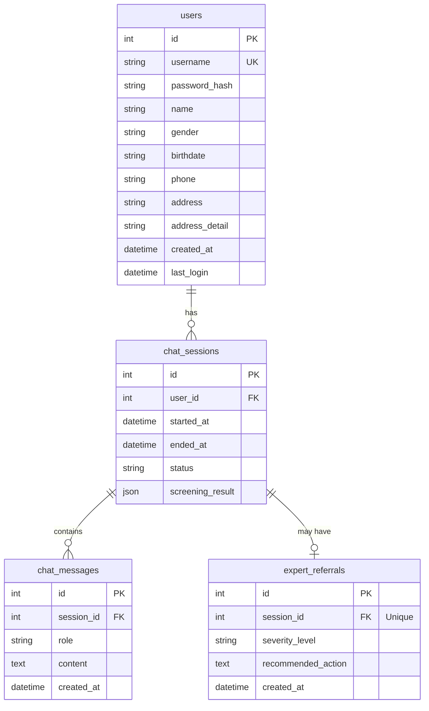

# SKN21-3rd-3Team

<div align="center" style="margin:0; padding:0;">
  
</div>

<div align="center" style="margin-top:-8px;">
  
</div>

<br>

---

<br>

<h2>1️⃣ 팀 구성 및 역할 분담</h2>
<p style="margin-bottom: 10px;">
  <strong>Team 수도</strong></p>
<p style="margin-top: 0; color: #666;">
  <em>📢 수빈님! 도와주세요! </em></p>

<table>
<tr>
<!-- 박수빈 -->
<td align="center" width="200" style="vertical-align: top; padding: 15px;">
    
    <h3 style="margin: 10px 0 5px 0;">박수빈</h3>
    <p style="margin: 5px 0;"> 
      <strong>대장</strong>  | 임베딩 설계 <br/>
      UI 화면 구현
    </p>
    <a href="https://github.com/sbpark2930-ui">
      
    </a>
</td>

<!-- 손현우 -->
<td align="center" width="200" style="vertical-align: top; padding: 15px;">
    
    <h3 style="margin: 10px 0 5px 0;">손현우</h3>
    <p style="margin: 5px 0;"> 
      테스트 설계 <br/> 
      RAG 성능평가
    </p>
    <a href="https://github.com/kevinhwsohn-afk">
        
    </a>
</td>
    
<!-- 우재현 -->
<td align="center" width="200" style="vertical-align: top; padding: 15px;">
    
    <h3 style="margin: 10px 0 5px 0;">우재현</h3>
    <p style="margin: 5px 0;">
      프롬프트 설계 <br/> 
      Answer/Chain 구현
    </p>
    <a href="https://github.com/Wjaehyun">
       
    </a>
</td>

<!-- 이성진 -->
<td align="center" width="200" style="vertical-align: top; padding: 15px;">
    
    <h3 style="margin: 10px 0 5px 0;">이성진</h3>
    <p style="margin: 5px 0;"> 
      데이터 수집 <br/>
      프롬프트 개선
    </p>
    <a href="https://github.com/krsjlee">
        
    </a>
</td>

<!-- 장이선 -->
<td align="center" width="200" style="vertical-align: top; padding: 15px;">
    
    <h3 style="margin: 10px 0 5px 0;">장이선</h3>
    <p style="margin: 5px 0;"> 
      데이터 전처리·청킹 <br/>
      README 작성 
    </p>
    <a href="https://github.com/jang-yiseon">
        
    </a>
</td>

<!-- 조남웅 -->
<td align="center" width="200" style="vertical-align: top; padding: 15px;">
    
    <h3 style="margin: 10px 0 5px 0;">조남웅</h3>
    <p style="margin: 5px 0;"> 
      Retriever 구현 <br/>
      Vector DB 검색
    </p>
    <a href="https://github.com/whskadnd">
        
    </a>
</td>
</tr>

</table>

<br>

---

<br>

## 2️⃣ 프로젝트 주제 및 주제 설명 및 선정 이유
- 최근 AI 기술의 발전과 함께 정서적 지원과 심리 상담 영역에서도 **대화형 인공지능을 활용하려는 시도**가 빠르게 확산되고 있습니다.  
AI 기반 심리상담 챗봇은 단순한 질의응답을 넘어, **사용자의 감정 상태를 인식하고 정서적 공감적 반응을 제공하는 방향**으로 발전하고 있으며, 국내외에서는 이미 정서 관리 및 자기 돌봄(Self-care) 도구**로 활용되고 있습니다.

- 이 서비스는 **심리 상담 대화 데이터**를 기반으로 한 RAG(Retrieval-Augmented Generation) 구조의 상담 챗봇을 구현을 목표로 합니다. 실제 상담 사례(텍스트 및 라벨 데이터)를 구조화하고 임베딩하여 유사 상담 맥락을 검색한 뒤 이를 바탕으로 보다 맥락적인 응답을 생성합니다. 사용자의 발화 흐름을 바탕으로 우울·불안 등 정서 상태를 참고 지표 수준에서 추정합니다.

- 서비스는 공감과 위로 중심의 응답과 함께 **일상에서 실천 가능한 간단한 정서 완화 방법** (예: 심호흡, 잠시 산책하기, 휴식 권유 등)을 제안하는 **초기 정서적 지원 및 자기 이해 보조 도구**로서의 역할을 지향합니다. 이를 통해 사용자가 자신의 감정 상태를 인식하고, 부담 없이 감정을 정리할 수 있도록 돕는 것을 목표로 합니다.

<table align="center" width="100%">
  <!-- 이미지 행 -->
  <tr>
    <td align="center">
      
    </td>
    <td align="center">
      
    </td>
    <td align="center">
      
    </td>
  </tr>

  <!-- 캡션 행 -->
  <tr>
    <td align="center">
      <div style="margin-top:12px; font-size:13px;">
        <b>① AI 상담 응답 사례</b>
      </div>
    </td>
    <td align="center">
      <div style="margin-top:12px; font-size:13px;">
        <b>② 멘탈케어 산업 확산 기사</b>
      </div>
    </td>
    <td align="center">
      <div style="margin-top:12px; font-size:13px;">
        <b>③ AI 심리상담 서비스 사례</b>
      </div>
    </td>
  </tr>
</table>

<br>

### 프로젝트 목표
* 📖 실제 심리 상담 데이터를 기반으로 한 **RAG 파이프라인 구축**
* 🧩 발화 단위 임베딩을 통한 **맥락 기반 상담 응답 생성**
* 🚨 대화 중 위험 신호 감지 및 **전문가 연결 로직 설계**
* 🧠 심리 카테고리(우울·불안·중독·일반)에 따른 **상담 흐름 분기**
* 🖥️ HTML 기반 **상담 챗봇 UI 구현**
  
<br>

### 모델 선정 배경
<table align="center" width="100%">
  <tr>
    <td align="center">
      
    </td>
    <td align="center">
      
    </td>
    <td align="center">
      
    </td>
  </tr>
  <tr>
    <td align="center"><b>GPT-4o</b></td>
    <td align="center"><b>GPT-4.1</b></td>
    <td align="center"><b>GPT-5-nano</b></td>
  </tr>
</table>

- OpenAI의 **GPT-4o** 모델을 적용하였다.
  실시간 상호작용을 전제로 하는 챗봇 특성상, 응답의 정확도와 함께 **응답 지연이 최소화**되는지 여부를 기준으로 모델을 선정하였다.

<br>

<table align="center" width="100%">
  <tr>
    <td align="center">
      
    </td>
    <td align="center">
      
    </td>
  </tr>
  <tr>
    <td align="center"><b>Doc Distance Comparison</b></td>
    <td align="center"><b>Response Time Comparison</b></td>
  </tr>
</table>

- 여러 모델을 비교한 결과, GPT-4o는 상담 맥락 이해와 응답 품질 측면에서 안정적인 성능을 유지하면서도 응답 속도가 가장 우수한 모델로 확인되었다.
   일부 모델의 경우 응답 생성에 수십 초 이상 소요되는 사례가 발생하여, 실시간 상담 흐름 유지에 적합하지 않다고 판단하였다.
  
> 이러한 이유로, 사용자 경험을 저해하지 않으면서도 충분한 상담 응답 품질을 제공할 수 있는 모델로 [OpenAI GPT-4o](https://platform.openai.com/docs/models/gpt-4o)를 최종 선정하였다.

<br>

### 전체 흐름 요약
1. 상담 데이터(json) 수집 및 전처리
2. 발화 단위 청킹 및 메타데이터 정리
3. 발화 내용 임베딩 후 ChromaDB 저장
4. 사용자 질문 → 유사 상담 사례 검색
5. 검색 컨텍스트 + 사용자 질문 → LLM 응답 생성
6. 대화 기록 및 위험도 DB 저장

<br>

### Tech Stack
#### 🔧 Backend / RAG


#### 🧠 Vector Search


#### 💾 Database


#### 🖥️ Frontend


#### ⚙️ Dev Environment


<br>

---

<br>

## 3️⃣ 📁프로젝트 디렉토리 및 파일 구조
</div>

```plaintext
SKN21-3rd-3Team/
├── data/                       
│   └── raw/                       # 원본 심리상담 데이터(json)
|
├── src/                       
│   ├── data/                   
│   |    ├── preprocess_data.py    # 상담 데이터 전처리
│   |    ├── embed_to_vectordb.py  # 전처리 데이터 임베딩 및 ChromaDB 저장
│   |    └── vector_loader.py      # VectorDB 로드 및 컬렉션 선택
|   |
│   ├── database/               
│   |    ├── vector_store.py       # ChromaDB 래퍼 및 검색 인터페이스
│   |    ├── database_schema.py    # 데이터 구조 정의
│   |    └── db_manager.py         # DB 접근 및 관리 로직
|   |
│   └── rag/                    
│        ├── rewrite.py             # 대화 히스토리 기반 쿼리 재작성
│        ├── retriever.py           # 유사 상담 사례 검색
│        ├── answer.py              # 답변 생성 및 후처리
│        └── chain.py               # RAG 전체 흐름 제어
|
├── app/                        
│    ├── main.py                    # Flask 엔트리포인트
│    ├── templates/                 # HTML 템플릿
│    └── static/                    # 정적 파일
|
├── config/                        # 설정 파일
├── docs/                          # 설계 문서 및 가이드
├── images/                        # README / 발표용 이미지
├── tests/                         # 테스트 코드
│
├── .gitignore
├── requirements.txt
└── README.md

```
<br>

---

<br>

## 4️⃣ 수집 데이터 설명
### 🔍 System & Data Overview

아래에 이어지는 상세 실험·설계 설명에 앞서, 이 프로젝트의 **데이터 구성, 처리 흐름, 챗봇 동작 방식, 안전 설계, 확장 방향**을 한눈에 요약합니다.

### 📊 데이터 개요
* **데이터 출처**: [AI Hub 심리상담 데이터셋](https://www.aihub.or.kr/aihubdata/data/view.do?pageIndex=1&currMenu=115&topMenu=100&srchOptnCnd=OPTNCND001&srchDetailCnd=DETAILCND001&srchOrder=ORDER001&srchPagePer=20&srchDataRealmCode=REALM006&aihubDataSe=data&dataSetSn=71806)
* **카테고리**: 우울(DEPRESSION), 불안(ANXIETY), 중독(ADDICTION), 일반(NORMAL)
* **형식**: json(상담 원문 발화 및 라벨, 메타데이터 ) 
* **구조**: 상담 세션 단위 → 발화(paragraph) 단위 분리
> 상세 데이터 구조 및 컬럼 정의는 **Data & Baseline Setup** 섹션에서 설명합니다.

<br>

### 🧠 데이터 전처리 & 임베딩 개요
* json 파일에서 `상담사 / 내담자` 발화를 기준으로 발화 단위 분리
* json 파일에서 연령, 성별, 상담 카테고리, 심리 지표(우울·불안·중독 등) 추출
* 발화 텍스트만 임베딩하여 ChromaDB(Vector DB)에 저장

<br>

### ⚠️ 윤리 및 안전 설계 개요
* 심리상담 챗봇은 **의료·심리 진단 도구가 아님!**
* 자해·자살 등 고위험 키워드 감지 시:
  - 즉각적인 주의 안내 메시지 제공
  - 전문 기관 또는 주변 도움을 권고하는 가이드 문구 출력
* 모든 상담 데이터는 **익명화된 공개 데이터**만 사용
> 안전 설계 및 스크리닝 로직은 **Safety & Screening Baseline** 섹션에서 상세히 다룹니다.

<br>

### 📌 향후 확장 방향 (요약)
* 상담 세션 시계열 기반 위험도 변화 추적
* 감정·정서 변화 추이 시각화
* 멀티모달 입력(음성 → 텍스트) 확장
* 전문가 피드백 기반 응답 평가 루프
* 심리 척도 기반 상태 추정 고도화
* 전문가 상담 연계(Referral / Escalation) 모듈
* 상담 기록 기반 맞춤형 행동·케어 플랜 추천
> 확장 아이디어에 대한 배경 및 근거는 **Future Work** 관련 문단에서 추가 설명될 수 있습니다.

<br>

### 📄 참고 문서
* `architecture.md` – 시스템 아키텍처
* `DATABASE_DESIGN.md` – DB/ERD 설계
* `DATA_ANALYSIS.md` – 데이터 분석 요약
* `data_collection.md` – 데이터 수집·임베딩 가이드
* `GUIDE_전처리.md` – 전처리 상세 가이드
* `GUIDE_CRUD.md` – ChromaDB CRUD
* `GUIDE_함수.md` – Vector DB 함수 정리

<br>

### Data & Baseline Setup
- **데이터 구조**  
  AI Hub 심리상담 데이터셋을 기반으로, 다수의 상담 대화 기록과 해당 대화에 대한 라벨 및 메타데이터가 JSON 형식으로 구성되어 있습니다.  
  원본 데이터는 `data/raw/` 디렉토리에 저장되어 있으며, 전처리 과정에서 대화 단위로 재구성된  
  데이터가 생성됩니다.  
  전처리 이후의 데이터는 학습 및 실험에 활용되지만, 용량 및 라이선스 이슈로 인해 Git 저장소에는  
  포함하지 않습니다.

  #### 🔹 `Original Dataset` — 원천 데이터 구조
  
  | 구분 | 파일 형식 | 설명 |
  |---|---|---|
  | 상담 대화 | `.json` | `상담사 :`, `내담자 :` 형식의 실제 상담 대화 원문 |
  | 메타데이터 | `.json` | 연령, 성별, 상담 카테고리, 요약, 심리 지표(우울/불안/중독 등) |

- **카테고리 구성**
  - `DEPRESSION` (우울)
  - `ANXIETY` (불안)
  - `ADDICTION` (중독)
  - `NORMAL` (일반)
 
<br>

### Data Preprocessing & Chunking 검증

- **전처리 목적**  
  비정형 상담 대화를 RAG 검색 및 응답 생성에 적합한 구조로 변환

- **전처리 파이프라인**
  1. json 파일 파싱 → 발화 단위 분리, 메타데이터 및 상담 요약 추출  
  2. 발화 단위 데이터와 메타데이터 통합  
  3. DB 저장용 구조로 변환

  #### 🔹 `Chunking Strategy` — 발화 단위 분리
  
  | 항목 | 설명 |
  |---|---|
  | 분리 기준 | `상담사 :` / `내담자 :` |
  | 저장 단위 | 발화(sentence-level) |
  | 포함 정보 | 화자, 발화 내용, 세션 내 순서 |
  - 동일 세션 내 발화는 순서를 유지하며 저장되어, 검색 결과가 실제 상담 흐름을 최대한 반영하도록 설계되었습니다.

<br>

### Data Preprocessing Strategy
심리상담 대화 데이터를 RAG 검색 및 응답 생성에 적합한 형태로 변환하기 위해, 파일 매칭·텍스트 정규화·화자 분리를 포함한 전처리 절차를 적용하였다.

#### Data Matching & Loading

  - File ID matching: 정규식 패턴 [DAXN]\d{3}을 기준으로 TXT(대화 원문)와 JSON(라벨/메타데이터) 파일을 매칭한다.
  
  - Encoding fallback: 한글 깨짐 방지를 위해 utf-8-sig → utf-8 → cp949 순서로 디코딩을 시도한다.


#### Text Normalization

  - RAG 검색 품질과 응답 생성을 안정화하기 위해, 데이터 내 특수 태그를 자연어 또는 일반화 토큰으로 정규화한다.

    >@COUNSELOR → 상담사
    >@NAME → 내담자
    >@PLACE, @AGE 등 → [PLACE], [AGE] 형태로 일반화 토큰을 유지

<br>

#### Speaker Segmentation

  - 정규식(상담사|내담자) 기반으로 화자를 명확히 분리한다.
  
  - 여러 줄로 이어지는 발화는 하나의 턴(Turn)으로 병합하여 대화 흐름이 끊기지 않도록 처리한다.

<br>

### Chunking Strategy (Window Sliding)
#### Overview

  - 대화 맥락을 유지하면서 검색 단위를 과도하게 키우지 않기 위해, **현재 발화(Current Turn)**를 중심으로 이전(Pre-context) 및 다음(Post-context) 발화를 포함하는 방식으로 청크를 생성한다.
    * Method: Window Sliding
    
    * Center: Current Turn
    
    * Context: Pre-context + Post-context (총 3턴 구성)

  - 예시:
  
    * (Context-1) 상담사: 요즘 기분이 좀 어떠세요?
    
    * (Current) 내담자: 계속 우울하고 잠도 잘 안 와요. (검색 중심)
    
    * (Context+1) 상담사: 불면증 때문에 많이 힘드시겠네요.
   
<br>

#### Rationale

  - Context awareness: 상담 데이터는 단일 발화만으로 의미가 부족한 경우가 많아, 앞뒤 문맥 포함이 필요하다.
  
  - Retrieval quality: 상담사의 질문과 내담자의 응답이 함께 포함된 청크는 상황 정보가 풍부하여 유사 사례 검색에 유리하다.
  
  - Token efficiency: 전체 세션 단위 임베딩 대비, 3턴 윈도우는 정보 밀도를 유지하면서도 컨텍스트 길이(토큰) 측면에서 효율적이다.

<br>

### Data Storage Strategy

  - 전처리 및 청킹 결과는 목적에 따라 관계형 저장소와 벡터 저장소로 분리하여 관리한다.
  
  - SQLite (mind_care.db): 사용자 정보, 채팅 세션 로그 등 구조화 데이터를 저장한다.
  
  - ChromaDB (vector_store): 청킹된 텍스트를 임베딩하여 벡터로 저장하며, category, speaker, session_id 등 메타데이터를 함께 저장해 필터 기반 검색을 지원한다.

<br>

---

<br>

## 5️⃣ 데이터 베이스 테이블 설명
### 데이터베이스 설계 개요 (ERD; Entity Relationship Diagram)



<br>

### 테이블 설명

#### 1. `users` (사용자)

| 컬럼           | 타입         | 설명                  |
| -------------- | ------------ | --------------------- |
| id             | INTEGER      | Primary Key           |
| username       | VARCHAR(50)  | 아이디 (Unique)       |
| password_hash  | VARCHAR(255) | Bcrypt 해시 비밀번호  |
| name           | VARCHAR(50)  | 이름                  |
| gender         | VARCHAR(10)  | 성별 (male/female)    |
| birthdate      | VARCHAR(10)  | 생년월일 (YYYY-MM-DD) |
| phone          | VARCHAR(20)  | 전화번호              |
| address        | VARCHAR(255) | 기본 주소             |
| address_detail | VARCHAR(255) | 상세 주소             |
| created_at     | DATETIME     | 생성일시              |
| last_login     | DATETIME     | 마지막 로그인         |

<br>

#### 2. `chat_sessions` (채팅 세션)

| 컬럼             | 타입        | 설명                               |
| ---------------- | ----------- | ---------------------------------- |
| id               | INTEGER     | Primary Key                        |
| user_id          | INTEGER     | 사용자 FK                          |
| started_at       | DATETIME    | 세션 시작 시간                     |
| ended_at         | DATETIME    | 세션 종료 시간                     |
| status           | VARCHAR(20) | 상태 (active, completed, referred) |
| screening_result | JSON        | 증상 선별 결과                     |

<br>

#### 3. `chat_messages` (채팅 메시지)

| 컬럼       | 타입        | 설명                             |
| ---------- | ----------- | -------------------------------- |
| id         | INTEGER     | Primary Key                      |
| session_id | INTEGER     | 세션 FK                          |
| role       | VARCHAR(10) | 발화자 (user, assistant, system) |
| content    | TEXT        | 메시지 내용                      |
| created_at | DATETIME    | 생성일시                         |

<br>

#### 4. `expert_referrals` (전문가 연결)

| 컬럼               | 타입        | 설명                                    |
| ------------------ | ----------- | --------------------------------------- |
| id                 | INTEGER     | Primary Key                             |
| session_id         | INTEGER     | 세션 FK (Unique)                        |
| severity_level     | VARCHAR(20) | 심각도 (mild, moderate, severe, crisis) |
| recommended_action | TEXT        | 권장 조치                               |
| created_at         | DATETIME    | 생성일시                                |

<br>

### 관계도 요약

```
users (1) ──── (N) chat_sessions (1) ──── (N) chat_messages
                        │
                        └──── (0..1) expert_referrals
```

- **users ↔ chat_sessions**: 1:N (한 사용자가 여러 채팅 세션 보유)
- **chat_sessions ↔ chat_messages**: 1:N (한 세션에 여러 메시지)
- **chat_sessions ↔ expert_referrals**: 1:0..1 (세션당 최대 1개의 전문가 연결)

<br>

### Database (ChromaDB)

- RAG을 위해 **ChromaDB(Vector Database)** 를 데이터베이스로 사용한다.
- ChromaDB는 텍스트 데이터를 임베딩 벡터로 저장하고, 벡터 간 유사도를 기반으로 관련 상담 발화를 검색하는 역할을 수행한다.
- 관계형 데이터베이스의 테이블 대신, ChromaDB의 **Collection 구조를 논리적인 데이터 테이블 단위로 정리**한다.

<br>

### ChromaDB Collection 구조

| 구성 요소 | 설명 |
|---|---|
| id | 문서(발화) 단위의 고유 식별자 |
| document | 상담 발화 원문 |
| embedding | 발화 텍스트의 임베딩 벡터 |
| metadata.session_id | 상담 세션 식별자 |
| metadata.category | 심리 상태 분류 (DEPRESSION / ANXIETY / ADDICTION / NORMAL) |
| metadata.speaker | 발화 주체 (user / assistant) |
| metadata.turn_index | 세션 내 발화 순서 |

<br>

### 데이터베이스 활용 방식
- 상담 발화 텍스트를 전처리한 후 임베딩하여 ChromaDB에 저장한다.
- 저장된 벡터는 유사도 검색을 통해 RAG Retriever 단계에서 활용된다.
- metadata 정보는 검색 결과 필터링 및 상담 맥락 유지를 위해 사용된다.

<br>

---

<br>

## 6️⃣ Application의 주요 기능
### 💬 챗봇 동작 방식 요약

1. 사용자 메시지 입력
2. 대화 기록 및 세션 정보 DB 저장
3. Vector DB에서 유사 상담 발화 검색
4. 검색 결과를 컨텍스트로 LLM 호출
5. 공감·위로 중심의 응답 생성 및 반환
6. 정서 위험 신호 감지 시 안전 안내 로직 활성화
> Retriever, RAG Chain, 응답 생성 로직에 대한 상세 설명은 **Retriever & RAG Baseline** 섹션을 참고합니다.

<br>

### Retriever & RAG Baseline

- **Retriever 구성**
  - ChromaDB 기반 cosine similarity 검색
  - 기본 검색 개수(`top-k`) 설정을 통해 유사 상담 맥락 추출

- **RAG 체인 흐름**
  1. 사용자 입력 수신
  2. 벡터 DB에서 유사 발화 검색
  3. 검색 결과를 컨텍스트로 LLM 호출
  4. 공감·위로 중심의 응답 생성
- 단순 프롬프트 기반 챗봇과 달리, 실제 상담 사례를 근거로 응답을 생성하도록 설계되었습니다.

<br>

### Limitations & Baseline 한계
- 단일 발화 또는 짧은 입력만으로는 사용자의 전체 정서 상태를 정확히 파악하기 어려움
- 데이터 분포상 고위험(자해/자살) 사례의 비중이 낮아, 위기 상황 대응에는 보수적인 설계가 필요함

<br>

### Safety & Screening Baseline
- json 메타데이터에 포함된 심리 지표(우울/불안/중독 등)를 활용하여 **간단한 정서 상태 스크리닝**을 수행합니다.

- 스크리닝 결과에 따라:
  - 공감 및 위로 메시지 제공
  - 심호흡, 산책, 휴식 등 **일상에서 실천 가능한 정서 완화 행동** 제안
  
<br>

---
<br>

## 7️⃣ 회고
### Final Summary & Key Takeaways

- 라벨(json) 데이터를 파싱하여 세션/턴 단위로 정규화하고,이를 기반으로 **구조화된 상담 데이터셋**을 구성
- 발화 단위 청킹 및 벡터화로 **유사 상담 맥락 검색** 가능
- RAG 기반 응답 생성으로 **맥락적·공감형 상담 응답** 제공

<br>

### ⚠️ 구현 도중 문제와 해결
#### 문제 상황
* 임베딩 기반 검색에서 Similarity Retriever와 MMR Retriever 중 어떤 방식이 상담 데이터에 더 적합한지 판단이 필요했다.
* 특히 동일한 Query와 top-k 조건에서 두 방식이 검색 결과의 다양성과 상담 맥락 유지 측면에서 어떤 차이를 보이는지가 명확하지 않았다.

#### 시도한 방법
* 동일한 Query와 top-k 조건 하에서 Similarity Retriever와 MMR Retriever를 각각 적용하여 검색 결과를 비교하였다.
* MMR의 경우 lambda_mult 값을 다르게 설정하여(0.5, 0.1) 유사도 중심 vs 다양성 중심 동작을 실험하였고, session_id 및 source_id 기준으로 결과 분산과 중복도를 비교 분석하였다.

#### 분석 및 한계
* lambda_mult=0.5 설정에서는 MMR이 유사도 중심으로 동작하여 결과적으로 Similarity Retriever와 세션 및 소스 다양성 측면에서 유의미한 차이를 보이지 않았다.
* 반면 lambda_mult=0.1과 같이 다양성을 과도하게 강조한 경우 결과 분산은 증가했으나 상담 맥락이 단절되거나 해석이 어려운 응답이 포함되어 실제 상담 응답 생성에는 부적합하다고 판단하였다.

#### 해결 및 최종 결정
* 상담 심리 데이터의 특성상 문맥의 일관성과 응답 해석 용이성이 중요하다고 판단해 구조적으로 안정적인 결과를 제공하는 **Similarity Retriever**를 최종적으로 선택하였다.

<br>

### 📝 팀원 소감 (Team Retrospective)

| 🧑‍💼 이름 | 🛠 역할 | 💬 소감 |
|-----------|-----------|-----------|
| **박수빈** | PM·UI | 채워주세요. |
| **손현우** | Testing.Evaluation.Prompt |  이번 프로젝트에서는 Prompt에 있어 테스팅과 Prompt를 직접 제작하며 챗봇의 흐름을 수정하는 역할을 맡았습니다. 심리 상담에 관련되어있어 상당히 민감한 챗봇인 만큼, 대화 흐름을 더 정교하면서도 공감 할수있게 수정하는 것이 결코 쉬운일이 아니라는 것을 진짜 큰 깨달음을 얻은 시간이였습니다. |
| **우재현** | Prompt·Chain | 채워주세요. |
| **이성진** | Data·Prompt | 챗봇. 누구나 만든다고. 그것도 아주 쉽게. 딸깍딸깍 몇 번으로. 이거 다 개소리다. 만들기야 쉽겠지. 지피티나 제미나이도 뚝닥. 하지만 '제대로' 만들었는지? 챗봇이 답변 잘하는지? 챗봇 답변 때문에 깊고 깊으며 깊은 빡침을 수도 없이 느꼈다. |
| **장이선** | Data | 전처리랑 청킹을 맡았는데, 2차 프로젝트의 경험 덕에 어렵지 않게 했던 것 같습니다. 아무래도 이번 프로젝트에서 제일 어려웠던 것은 모델의 성능 개선이었던 것 같은데… 제가 할 수 있던 게 없어서 README 작성을 맡게 되었고, 평소 책을 잘 안 읽었더니 가독성이 너무 구린 결과물을 도출해낸 것 같아서 많이 아쉽습니다... 그리고 이것 또한 쉽지 않았고, 프로젝트에서 쉬운 것은 하나도 없다는 교훈을 얻었습니다. (쉽게 갈 생각을 한 건 아닙니다!!!🙅‍♀️🙅‍♀️) |
| **조남웅** | Retriever | 이번 프로젝트는 역할은 크게 어려움 없이 잘 갔던 거 같습니다. 팀을 이끌어주신 수빈님과 재현님께 감사드립니다. 또한 프롬프트 문장과 모델에 따라 AI가 학습하는 방향이 달라져서 흥미롭고 재미있는 프로젝트가 되었습니다. |
