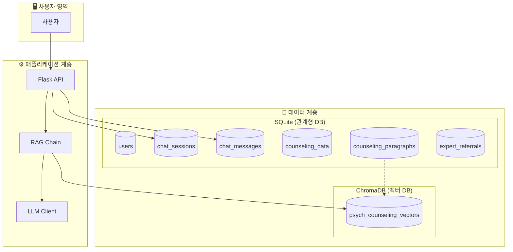
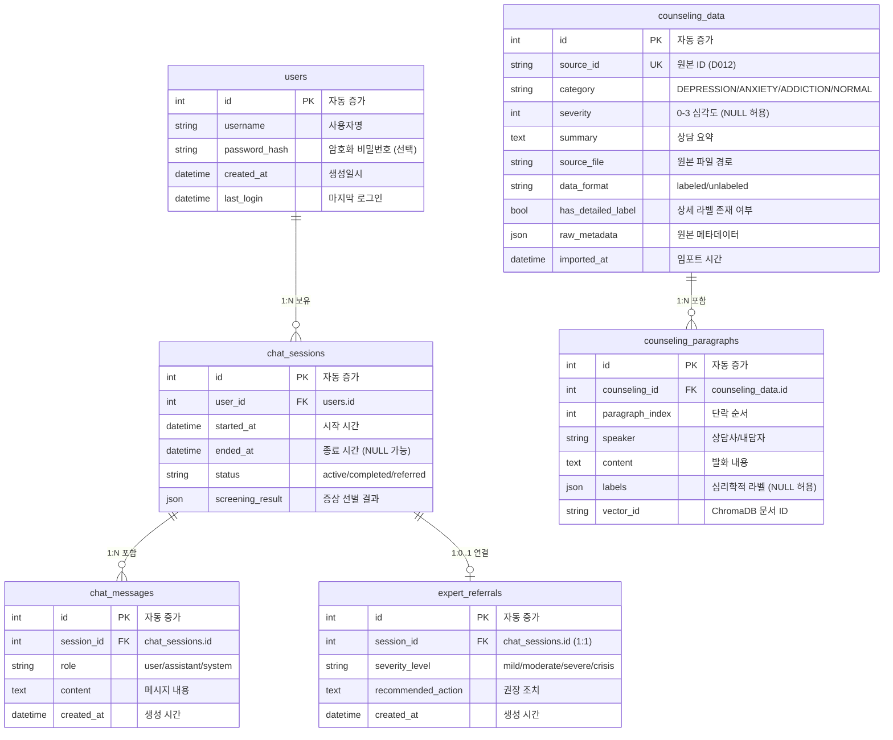
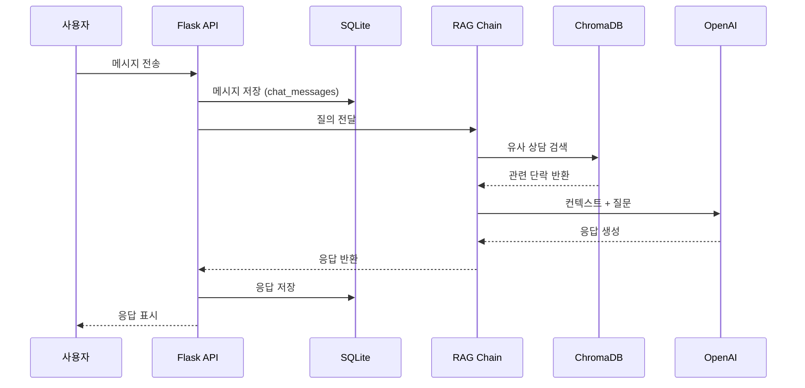

# 데이터베이스 설계 문서

---

## 1. 아키텍처 개요



---

## 2. ERD (Entity Relationship Diagram)



---

## 3. 테이블 설명

### 3.1 사용자 관련

| 테이블 | 용도 | 비고 |
|--------|------|------|
| **users** | 사용자 정보 | 익명 사용 가능 |
| **chat_sessions** | 채팅 세션 | 상태 추적 (active/completed/referred) |
| **chat_messages** | 대화 기록 | role로 화자 구분 |
| **expert_referrals** | 전문가 연결 | 세션당 최대 1회 |

### 3.2 상담 데이터

| 테이블 | 용도 | 비고 |
|--------|------|------|
| **counseling_data** | 상담 세션 원본 | 메타데이터 포함 |
| **counseling_paragraphs** | 발화 단위 분할 | Vector DB와 연동 |

---

## 4. 데이터 흐름



---

## 5. 주요 파일

| 파일 | 설명 |
|------|------|
| [db_config.py](file:///c:/SKN21-3rd-3Team/config/db_config.py) | DB 경로 설정 |
| [database_schema.py](file:///c:/SKN21-3rd-3Team/src/database/database_schema.py) | ORM 모델 정의 |
| [vector_store.py](file:///c:/SKN21-3rd-3Team/src/database/vector_store.py) | ChromaDB 래퍼 |
| [db_manager.py](file:///c:/SKN21-3rd-3Team/src/database/db_manager.py) | 통합 CRUD |

---

## 6. 사용 예시

```python
from src.database import DatabaseManager

# 초기화
db = DatabaseManager()

# 상담 데이터 저장
counseling = db.add_counseling_data(
    source_id="D012",
    category="DEPRESSION",
    severity=2
)

# 단락 저장 (자동으로 VectorDB에도 저장)
db.add_counseling_paragraph(
    counseling_id=counseling.id,
    paragraph_index=0,
    speaker="내담자",
    content="요즘 너무 우울해요..."
)

# 유사 상담 검색
results = db.search_similar_counseling("우울한 기분", n_results=5)
```
