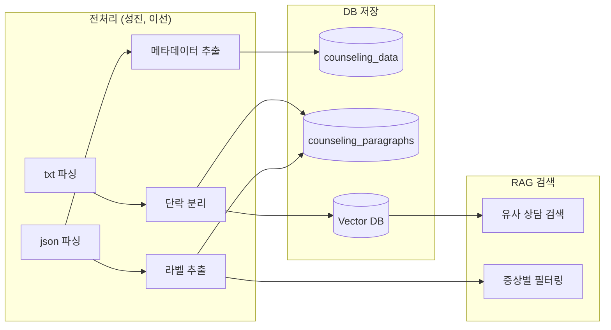

# 데이터 분석표

---

## 1. 데이터 개요

| 항목 | 값 |
|------|-----|
| **총 파일 수** | 32개 (txt 16개 + json 16개) |
| **카테고리** | 4개 (우울증, 불안장애, 중독, 일반군) |
| **회기** | 1회기 (샘플) |
| **파일 형식** | txt(원천) + json(라벨링) 쌍 |

---

## 2. 카테고리별 파일 목록

| 카테고리 | 코드 | 파일 ID | 파일 수 |
|----------|------|---------|--------|
| **우울증** | DEPRESSION | D012, D013, D014, D015 | 4개 |
| **불안장애** | ANXIETY | X007, X008, X009, X012 | 4개 |
| **중독** | ADDICTION | A024, A035, A040, A063 | 4개 |
| **일반군** | NORMAL | N015, N016, N017, N018 | 4개 |

---

## 3. 파일 구조

### 3.1 원천 데이터 (txt)

**경로:** `tests/testdata/Sample/Sample/01.원천데이터/{카테고리}/{회기}/resource_*.txt`

**형식:**
```
상담사 : 안녕하세요. 오늘 기분이 어떠세요?
내담자 : 요즘 좀 우울해요. 아무것도 하기 싫어요.
상담사 : 그렇군요. 언제부터 그런 느낌이 드셨나요?
...
```

**특징:**
- `상담사 : ` 또는 `내담자 : ` 로 시작
- 개인정보는 `@NAME`, `@AGE`, `@COMPANY` 등으로 마스킹됨
- 약 200~600줄 (발화 수 기준)

---

### 3.2 라벨링 데이터 (json)

**경로:** `tests/testdata/Sample/Sample/02.라벨링데이터/{카테고리}/{회기}/label_*.json`

**최상위 구조:**
```json
{
    "filename": "label_depression_1_check_D012",
    "id": "D012",
    "age": 31,
    "gender": "남",
    "depression": 2,
    "anxiety": 0,
    "addiction": 0,
    "class": "DEPRESSION",
    "summary": "주요 증상: ...",
    "paragraph": [...]
}
```

---

## 4. 메타데이터 필드

| 필드 | 타입 | 설명 | 예시 |
|------|------|------|------|
| `id` | string | 내담자 ID | D012, X007 |
| `age` | int | 나이 | 31 |
| `gender` | string | 성별 | "남", "여" |
| `depression` | int | 우울증 지표 (0-2) | 2 |
| `anxiety` | int | 불안장애 지표 (0-2) | 0 |
| `addiction` | int | 중독 지표 (0-2) | 0 |
| `class` | string | 분류 | DEPRESSION |
| `summary` | string | 상담 요약 (자동 생성) | "주요 증상: ..." |

---

## 5. 단락(paragraph) 라벨 필드 (40개)

### 5.1 증상 관련 (10개)

| 필드명 | 한글 | 설명 |
|--------|------|------|
| `depressive_mood` | 우울 기분 | 우울한 감정 표현 |
| `worthlessness` | 무가치감 | 자신이 가치없다는 느낌 |
| `guilt` | 죄책감 | 잘못에 대한 과도한 죄책감 |
| `impaired_cognition` | 인지 손상 | 집중력, 결정력 저하 |
| `suicidal` | 자살 사고 | ⚠️ 자살 관련 언급 |
| `anhedonia` | 무쾌감증 | 즐거움 상실 |
| `psychomotor_changes` | 정신운동 변화 | 말/행동 느려짐 or 초조 |
| `weight_appetite` | 체중/식욕 변화 | 체중/식욕 변화 |
| `sleep_disturbance` | 수면 장애 | 불면/과수면 |
| `fatigue` | 피로감 | 지속적 피로 |

### 5.2 위험 요인 (8개)

| 필드명 | 한글 | 설명 |
|--------|------|------|
| `trauma_experience` | 트라우마 경험 | 과거 외상 경험 |
| `negative_self-image` | 부정적 자아상 | 자기 비하 |
| `emotional_requlation` | 정서 조절 | 감정 조절 어려움 |
| `loss_of_control` | 통제력 상실 | 상황 통제 불능 |
| `family_history` | 가족력 | 가족 내 정신질환 |
| `underlying_physical_condition` | 신체 질환 | 기저 신체 질환 |
| `history_of_mental_illness` | 정신질환 이력 | 과거 정신과 치료 |
| `stressful_event` | 스트레스 사건 | 최근 스트레스 |

### 5.3 개선 요인 (8개)

| 필드명 | 한글 | 설명 |
|--------|------|------|
| `motivation_for_change` | 변화 동기 | 개선 의지 |
| `belief` | 신념 | 긍정적 신념 |
| `unrealistic_recovery_expectations` | 비현실적 기대 | 과도한 회복 기대 |
| `coping` | 대처 전략 | 스트레스 대처 |
| `lifestyle` | 생활습관 | 건강한 생활 |
| `social_support` | 사회적 지지 | 지지체계 |
| `social_resources` | 사회적 자원 | 활용 가능 자원 |
| `enhancement_of_motivation` | 동기 강화 | 동기 향상 |

### 5.4 변화 요인 (4개)

| 필드명 | 한글 | 설명 |
|--------|------|------|
| `emotional_change` | 정서 변화 | 감정 변화 |
| `cognitive_change` | 인지 변화 | 생각 변화 |
| `behavioral_change` | 행동 변화 | 행동 변화 |
| `acceptance_change` | 수용 변화 | 상황 수용 |

### 5.5 상담사 개입 (10개)

| 필드명 | 한글 | 설명 |
|--------|------|------|
| `sympathy_support` | 공감/지지 | 상담사 공감 |
| `clarification_reflection` | 명료화/반영 | 내담자 말 재진술 |
| `cognitive_restructuring` | 인지 재구성 | 생각 패턴 변화 유도 |
| `information_provision` | 정보 제공 | 관련 정보 전달 |
| `goal_setting` | 목표 설정 | 상담 목표 설정 |
| `process_feedback` | 과정 피드백 | 상담 진행 피드백 |
| `behavioral_intervention` | 행동 개입 | 행동 변화 유도 |
| `task_assignment` | 과제 부여 | 실천 과제 |
| `training_of_coping_skills` | 대처 기술 훈련 | 대처법 교육 |
| `emotional_regulation_education_training` | 정서 조절 교육 | 감정 조절 훈련 |

---

## 6. 라벨 값 설명

| 값 | 의미 |
|----|------|
| **0** | 해당 없음 |
| **1** | 해당함 |

---

## 7. 데이터 활용 방안

